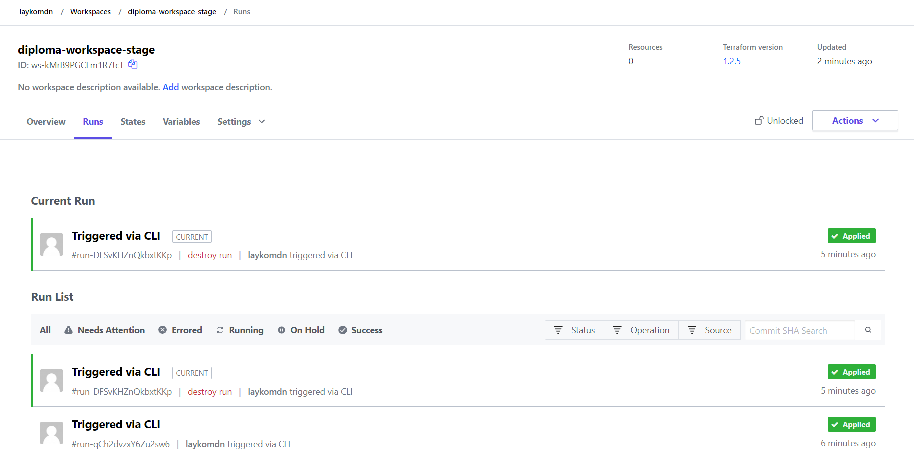

1.  Регистрация доменного имени
Зарегистрировал доменное имя и делегировал его в сервис Яндекс.Коннект.
Домен wedun.ru

2. Создание инфраструктуры  
Создали сервисный аккаунт "tfservice"  
Создали Backend "remote" в Terraform Cloud  
Создали Workspace "diploma-workspace-stage"  
Создали VPC с подсетями в разных зонах доступности  
Проверили, что команды 'terraform destroy' и 'terraform apply' выполняются без дополнительных ручных действий  
Проверили, что применение изменений успешно проходит, используя web-интерфейс Terraform cloud  

3. Установка Nginx и LetsEncrypt
