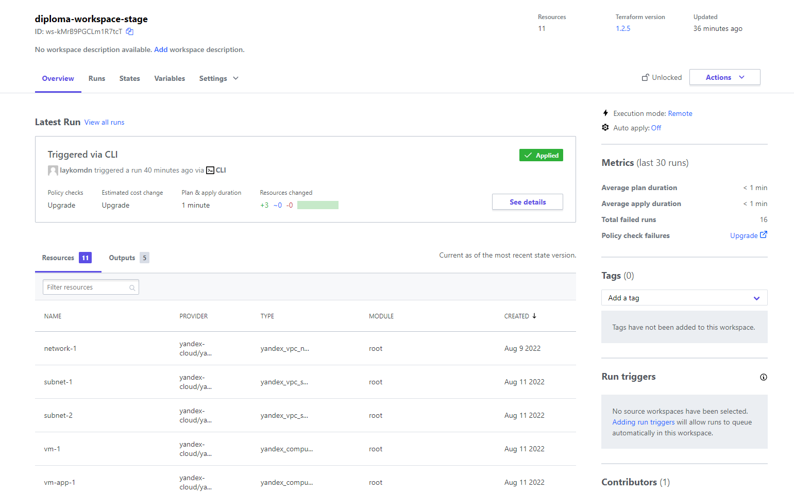
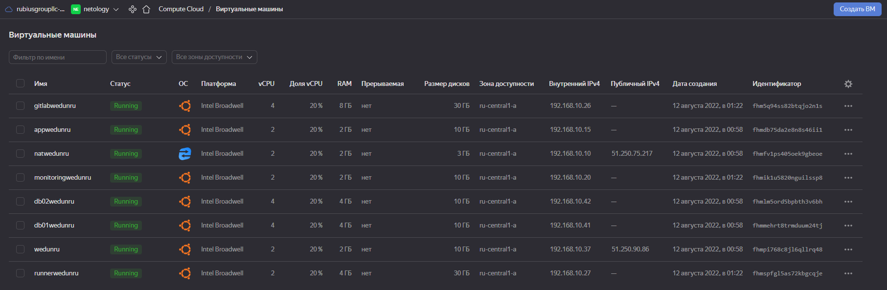

1.  Регистрация доменного имени
Зарегистрировал доменное имя и делегировал его в сервис Яндекс.Коннект.
Домен wedun.ru

2. Создание инфраструктуры  
Создали сервисный аккаунт "tfservice"  
Создали Backend "remote" в Terraform Cloud  
Создали Workspace "diploma-workspace-stage"  
Создали VPC с подсетями в разных зонах доступности  
Проверили, что команды 'terraform destroy' и 'terraform apply' выполняются без дополнительных ручных действий  
Проверили, что применение изменений успешно проходит, используя web-интерфейс Terraform cloud  


## Terraform
Файлы конфигурации доступны по [ссылке](https://github.com/wedun/netology-diploma/tree/master/infra)

В файлах terraform вынесены параметры для каждого типа серверов:

- В файле main.tf описана конфигурация для reverce proxy и nat виртуальных машин.
- В файле mysql.tf описана конфигурация для mysql master и slave виртуальных машин.
- В файле gitlab.tf описана конфигурация для gitlab и gitlab-runner виртуальных машин.
- В файле app.tf описана конфигурация для виртуальной машины сервера приложений.
- В файле network.tf описана конфигурация для подсетей в которых размещаются виртуальные машины.
- В файле output.tf описана конфигурация для подключения к виртуальным машинам.
- В файле monitoring.tf описана конфигурация для настройки мониторинга виртуальных машин.

В Terraform Cloud добавим переменную окружения 'YC_TOKEN', в этой переменной сохраним токен подключения к Яндеккс.Облаку.

Выполним команду 'terraform apply -auto-approve' и проверим результат в Terraform Cloud


Проверим виртуальные машины в Яндекс.Облако


## Ansible

В репозитоии были созданы роли для каждого задания. Роли доступны по [ссылке](https://github.com/wedun/netology-diploma/tree/master/ansible/roles)

1. Установка кластера mysql
'ansible-galaxy role init database-slave-role' - эта роль устанавливает и настраивает slave ноду в кластере mysql

2. Установка общих ролей
ansible-galaxy role init common-role - эта роль устанавливает и настраивает сервисы, требуемые другим ролям (docker, node-exporter)

3. Установка Nginx и LetsEncrypt
'ansible-galaxy role init reverse-proxy-role' - эта роль устанавливает и настраивает nginx и certbot

4. Установка кластера mysql
'ansible-galaxy role init database-role' - эта роль устанавливает и настраивает master ноду в кластере mysql

5. Установка wordpress
'ansible-galaxy role init wordpress-role' - эта роль устанавливает и настраивает сайт на Wordpress

6. Установка Gitlab
'ansible-galaxy role init gitlab-role' - эта роль устанавливает и настраивает Gitlab

7. Установка Monitoring
'ansible-galaxy role init monitoring-role' - эта роль устанавливает и настраивает Alertmanager, Prometheus, Grafana

8. Установка Gitlab runner
'ansible-galaxy role init gitlab-runner-role' - эта роль устанавливает и настраивает Gitlab runner

Доступ к серверам в закрытой сети реализован через NAT инстанс в Яндекс.Облако и SSH JumpHost. Для запуска Ansible необходимо настроить SSH.
Добавим в '~/.ssh/config' сформированную ранее конфигурацию для подключения к виртуальным машинам
```bash
Host www.wedun.ru
  HostName 51.250.90.86
  User ubuntu
  IdentityFile ~/.ssh/id_rsa
Host db01.wedun.ru
  HostName db01.wedun.ru
  User ubuntu
  IdentityFile ~/.ssh/id_rsa
    ProxyJump ubuntu@51.250.75.217
    ProxyCommand ssh -W %h:%p -i .ssh/id_rsa
Host db02.wedun.ru
  HostName db02.wedun.ru
  User ubuntu
  IdentityFile ~/.ssh/id_rsa
    ProxyJump ubuntu@51.250.75.217
    ProxyCommand ssh -W %h:%p -i .ssh/id_rsa
Host app.wedun.ru
  HostName app.wedun.ru
  User ubuntu
  IdentityFile ~/.ssh/id_rsa
    ProxyJump ubuntu@51.250.75.217
    ProxyCommand ssh -W %h:%p -i .ssh/id_rsa
Host monitoring.wedun.ru
  HostName 192.168.10.11
  User ubuntu
  IdentityFile ~/.ssh/id_rsa
    ProxyJump ubuntu@51.250.75.217
    ProxyCommand ssh -W %h:%p -i .ssh/id_rsa
Host gitlab.wedun.ru
  HostName 192.168.10.26
  User ubuntu
  IdentityFile ~/.ssh/id_rsa
    ProxyJump ubuntu@51.250.75.217
    ProxyCommand ssh -W %h:%p -i .ssh/id_rsa
Host runner.wedun.ru
  HostName 192.168.10.27
  User ubuntu
  IdentityFile ~/.ssh/id_rsa
    ProxyJump ubuntu@51.250.75.217
    ProxyCommand ssh -W %h:%p -i .ssh/id_rsa
```

В файл 'variables.yml' необходимо указать список IP адресов. Файл доступен по [ссылке](https://github.com/wedun/netology-diploma/blob/master/ansible/roles/variables.yml)
В файл 'prometheus.yml' необходимо указать список IP адресов. Файл доступен по [ссылке](https://github.com/wedun/netology-diploma/blob/master/ansible/roles/monitoring-role/files/prometheus/prometheus.yml)

